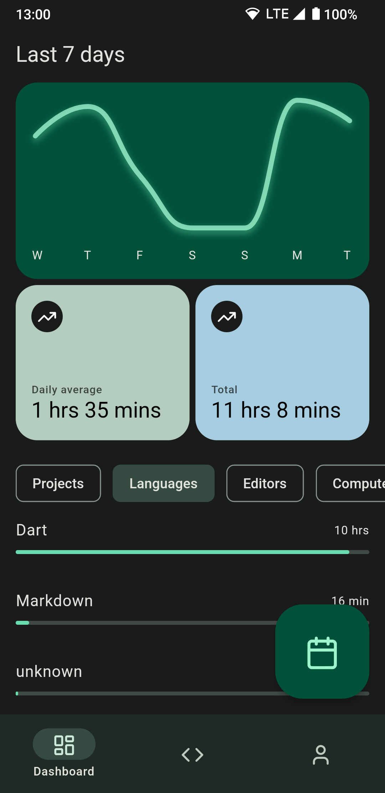

# WakaBoard

An open source dashboard client for WakaTime and compatible server implementations (like [Wakapi](https://github.com/muety/wakapi)).

## Contributing
Contributions are always welcome! To contribute to the project:
 - Fork the repository and clone it on your local machine
 - [Install Flutter](https://docs.flutter.dev/get-started/install) if you don't have it already installed 
 - Download the dependencies: `flutter pub get`
 - Start build_runner to generate the .g.dart files for the models: `dart run build_runner build --delete-conflicting-outputs` or `dart run build_runner watch`
 - When your contribution is ready, create a pull request